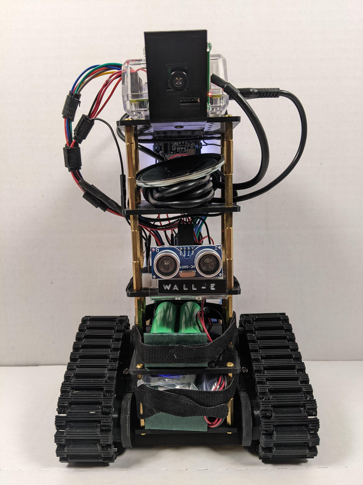
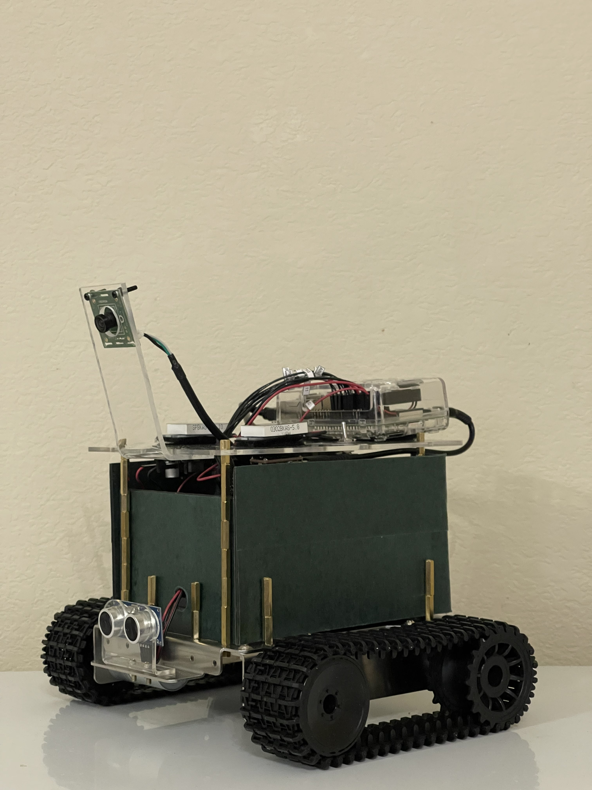

<!-- Sacramento State Logo and Title -->
<br />
<div align="center">
  <a href="https://www.csus.edu/">
    
  </a>

  <h1 align="center">Team 2</h1>

  <p align="center">
    CpE 190-191 - Senior Design:<br /><b><h3>Self-Driving Remote Controlled Car</h3></b>
    <br />
    <br />
    <a href="https://youtube.com/playlist?list=PLHFOvcVOvE2IlpS0oUwSvtJbdVLczmRdj">View Demo</a><br />
    <a href="https://youtube.com/playlist?list=PLHFOvcVOvE2IlpS0oUwSvtJbdVLczmRdj"></a>
  </p>
</div>
<br />

<!-- ABOUT THE PROJECT -->
## About The Project
For the reason of safety, we utilized a scale model car design, no larger than a typical remote-controlled car to demonstrate our manual and full self-driving capabilities. Two different model car designs were used for testing and demonstration. The first design utilized a fused filament fabricator, structural parts could then be 3D printed and assembled. The second design was assembled using fabricated acrylic and prefabricated metal parts. The drive system on both cars uses a differential drive. The autonomous drive source code can be modified to support any vehicle of any size capable of wheeled locomotion. The core components of our self-driving car design consist of computer vision, object detection, distance sensing, a convolutional neural net and a single board computer capable of running Debian based Linux for CPU dependent tasks. 
<br />
| Model 1 | Model 2 |
| :----: |    :----:   |
|  |  |

### Built With
* 
* 
* 
<br />

<!-- GETTING STARTED -->
## Getting Started
The following section will cover the minimum required hardware and software installation.

### Prerequisites
The minimum required hardware is:
* Single board computer (Raspberry Pi 4)
* Differential drive system
* USB Camera

Software:
* Pip3
  ```sh
  python -m pip3 install --upgrade pip
  ```

### Installation
1. Clone the repo
   ```sh
   git clone https://github.com/csus-cpe190-191-team2/Team2.git
   ```
2. Install required packages
   ```sh
   pip3 install -r requirements.txt
   ```


